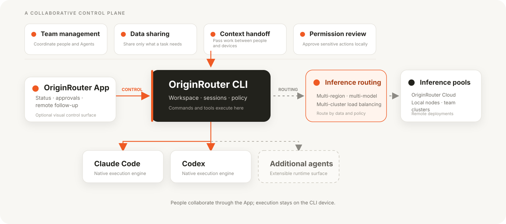

<p align="center">
  
</p>

<p align="center">
  <strong>English</strong> · <a href="README.zh-CN.md">简体中文</a>
</p>

<p align="center">
  Run Claude Code and Codex from one local control plane.<br />
  Coordinate work, route models, apply approvals, and follow sessions from another device.
</p>

<p align="center">
  <a href="https://www.npmjs.com/package/@originrouter/cli"></a>
  <a href="https://github.com/originrouter/originrouter_cli/actions/workflows/ci.yml"></a>
  
  <a href="LICENSE"></a>
</p>

<p align="center">
  <a href="#quick-start">Quick start</a>
  · <a href="#choose-your-entry-point">Choose an entry point</a>
  · <a href="https://originrouter.com/docs/originrouter-cli/overview">CLI docs</a>
  · <a href="https://originrouter.com/docs/originrouter-app/overview">App docs</a>
  · <a href="https://github.com/originrouter/originrouter_cli/issues">Issues</a>
</p>

> [!IMPORTANT]
> OriginRouter CLI is pre-1.0. Read the release notes before upgrading; preview
> releases may include documented migrations.

## What is OriginRouter CLI?

OriginRouter CLI is the local execution and control layer around the coding
Agents you already use. Claude Code and Codex remain the execution engines;
OriginRouter gives them one workspace for routing, collaboration, approvals,
session control, and remote follow-up.

- Start with an objective instead of assembling several Agent commands by hand.
- Use Claude Code or Codex directly, or let the Agent Workspace coordinate a team.
- Route requests through OriginRouter Cloud, local model services, or trusted remote clusters, with policy-based load balancing across regions.
- Keep commands, tools, workspace access, and approval decisions on the executing device.
- Connect the optional OriginRouter App to inspect state, handle approvals, and follow work remotely.

<p align="center">
  
</p>

## Choose your entry point

| Entry point | Use it when |
| --- | --- |
| `originrouter` | You need a persistent workspace, planning, delegation, or review. |
| `originrouter claude` | You want the native Claude Code terminal experience with OriginRouter control. |
| `originrouter codex` | You want the native Codex terminal experience with OriginRouter control. |
| OriginRouter App | You want visual status, approvals, or remote follow-up from another device. |

The App is optional. Local commands, tools, and workspace access always run on
the CLI device.

## Install

### Recommended: official installer

macOS, Linux, and WSL:

```bash
curl -fsSL https://originrouter.com/install.sh | bash
```

Windows PowerShell:

```powershell
irm https://originrouter.com/install.ps1 | iex
```

The installer installs the CLI and starts the guided setup. Setup checks and,
after confirmation, installs missing Claude Code and Codex runtimes, the
OriginRouter background service, managed Python, and the Local Proxy runtime.

### Install from npm

Use npm when you need to manage the CLI version yourself:

```bash
npm install --global @originrouter/cli
originrouter setup
```

Requirements:

- Node.js 22 or later.
- Network access to npm and the official Claude Code and Codex installers.
- A Cloud account or model-service credentials are only needed for the route you choose later.

Local Proxy is included in the complete setup because it supports local,
third-party, enterprise, and self-hosted model services. If you only use
OriginRouter Cloud or already-authorized remote devices and do not need those
model-service routes, skip it explicitly:

```bash
originrouter setup --no-proxy
```

For automation, use `originrouter setup --yes`; preview the plan with
`originrouter setup --dry-run`. See the [CLI installation guide](https://originrouter.com/docs/originrouter-cli/overview)
for platform-specific details.

## Quick start

After installation, open a project and start the Agent Workspace:

```bash
cd your-project
originrouter
```

Submit an objective directly:

```bash
originrouter "Fix the login timeout and add regression tests"
```

Or keep the native Agent terminal:

```bash
originrouter claude
originrouter codex
```

To use OriginRouter Cloud routes, sign in and initialize them once:

```bash
originrouter login
originrouter agent setup --cloud
originrouter doctor
```

Use the native Agent configuration instead when you want to keep the official
Claude Code or Codex subscription, login state, environment, and project
configuration:

```bash
originrouter claude --native-config
originrouter codex --native-config
```

Read [CLI quickstart](https://originrouter.com/docs/originrouter-cli/quickstart)
for the complete first-run flow.

## What you can do next

### Coordinate larger tasks

The Agent Workspace keeps a long-lived conversation around a project. Use it
for planning, implementation, independent review, verification, and supported
cross-device work. Choose a mode with `--mode`, or switch inside the Workspace.

```bash
originrouter --mode plan-build-verify "Prepare and verify the migration"
```

See [Agent Workspace](https://originrouter.com/docs/originrouter-cli/agent-workspace)
and [multi-agent collaboration](https://originrouter.com/docs/originrouter-cli/collaboration).

### Connect a model service

Use Cloud routes for the simplest start. Use a local model service, enterprise
gateway, or self-hosted model when its credentials and network should remain on
your device. Configure it with `provider` and `route` commands; the Local Proxy
guide explains the available integrations.

See [models and routing](https://originrouter.com/docs/originrouter-cli/routing)
and the [model-service reference](https://originrouter.com/docs/originrouter-cli/providers-reference).

### Follow work from the App or another device

Install OriginRouter App, sign in, and connect a CLI device that is online and
trusted. The App can display sessions, deliver supported input, and handle
approvals. Remote model sharing and workspace access are separate permissions
that you enable only when needed.

See [remote access](https://originrouter.com/docs/originrouter-cli/remote),
[App overview](https://originrouter.com/docs/originrouter-app/overview), and
[devices and security](https://originrouter.com/docs/originrouter-app/devices-security).

## Common commands

| Goal | Command |
| --- | --- |
| Open the current project | `originrouter` |
| Run Claude Code | `originrouter claude` |
| Run Codex | `originrouter codex` |
| Check installation and connectivity | `originrouter doctor` |
| Initialize or repair the local runtime | `originrouter setup` |
| Sign in or sign out | `originrouter login` / `originrouter logout` |
| Manage model services | `originrouter provider` |
| Inspect routes | `originrouter route list` |
| Inspect devices and sessions | `originrouter devices` / `originrouter sessions` |
| Show every command and option | `originrouter help all` |

Run `originrouter --help` for the task-oriented overview.

## Security and data boundaries

- Workspace files, shell commands, tools, and Agent execution stay on the CLI device.
- The Local API requires a device key, including when it listens only on `127.0.0.1`.
- Remote control does not expose model-service credentials or grant workspace access by itself.
- Requests sent to Cloud or another model service follow that service's terms and data policy.

Read [data and execution boundaries](https://originrouter.com/docs/originrouter-concepts/data-boundaries)
and [SECURITY.md](SECURITY.md) for the full model.

## Documentation

- [CLI overview and installation](https://originrouter.com/docs/originrouter-cli/overview)
- [CLI quickstart](https://originrouter.com/docs/originrouter-cli/quickstart)
- [Agent Workspace](https://originrouter.com/docs/originrouter-cli/agent-workspace)
- [Models and routing](https://originrouter.com/docs/originrouter-cli/routing)
- [Command reference](https://originrouter.com/docs/originrouter-cli/commands)
- [CLI troubleshooting](https://originrouter.com/docs/originrouter-cli/troubleshooting)
- [OriginRouter App documentation](https://originrouter.com/docs/originrouter-app/overview)

For development setup and contribution rules, see [CONTRIBUTING.md](CONTRIBUTING.md).

## Third-party products and license

OriginRouter is an independent open-source project. It is not affiliated with,
endorsed by, or sponsored by Anthropic or OpenAI. Claude Code and Codex remain
subject to their own accounts, licenses, terms, and policies.

AI-generated output and actions can be inaccurate or unsafe. Review them before
relying on or executing them.

OriginRouter is licensed under the [Apache License 2.0](LICENSE). See
[THIRD_PARTY_NOTICES.md](THIRD_PARTY_NOTICES.md) for dependency and runtime notices.
