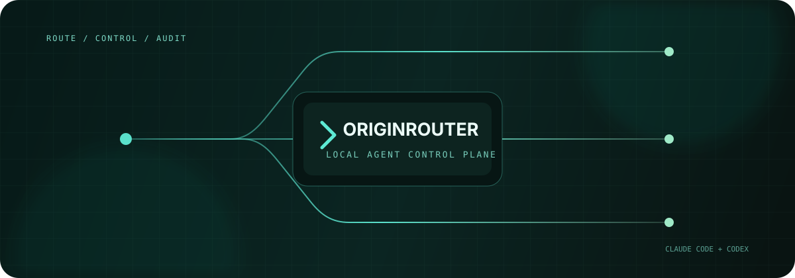

<p align="center">
  
</p>

<p align="center">
  Run Claude Code and Codex through one device-owned control plane.<br />
  Route models, control remote sessions, apply approval policy, and keep a local audit trail.
</p>

<p align="center">
  <a href="https://www.npmjs.com/package/originrouter"></a>
  <a href="https://github.com/originrouter/originrouter_cli/actions/workflows/ci.yml"></a>
  
  <a href="LICENSE"></a>
</p>

<p align="center">
  <a href="https://originrouter.com/docs/originrouter-tools/cli">Documentation</a>
  · <a href="#quick-start">Quick start</a>
  · <a href="#command-map">Commands</a>
  · <a href="https://github.com/originrouter/originrouter_cli/issues">Issues</a>
</p>

> [!IMPORTANT]
> OriginRouter CLI is currently pre-1.0. Command names and persisted schemas are
> compatibility-sensitive, but preview releases may include documented migrations.

## One runtime, three model sources

OriginRouter wraps the agents you already use. It does not replace their native
terminal UI, project configuration, resume syntax, or local execution.

| Source | Use it when | Configure with |
| --- | --- | --- |
| Native agent configuration | Keep the agent's existing login and model | `--originrouter-native-config` |
| Local provider via LiteLLM | Route to your own provider credentials | `provider`, `route`, `proxy` |
| OriginRouter Cloud or remote CLI | Use account models or another authorized device | `login`, `route cloud`, `route remote` |

```text
OriginRouter App (optional)
        │ authenticated local API / encrypted account bridge
        ▼
OriginRouter CLI daemon ─── sessions · policy · local audit
        │
        ├── Claude Code / Codex
        └── Compatibility Gateway ── LiteLLM ── model provider
```

The CLI device remains the execution and policy authority. Provider credentials
stay local, and remote agent payloads use device end-to-end encryption.

## Why OriginRouter

- Preserve native Claude Code and Codex arguments, TUI behavior, and resume flows.
- Route models consistently across local providers, cloud models, and remote devices.
- Follow sessions, send messages, stop work, and answer supported prompts remotely.
- Evaluate manual, guarded, AI-review, unrestricted, or custom approval policy locally.
- Apply signed, sandboxed protocol compatibility patches without exposing credentials.
- Keep approval and external-change events in an append-only, hash-linked local ledger.
- Coordinate Claude and Codex participants in plan/implement/verify collaborations.

## Install

Published package:

```bash
npm install --global originrouter
originrouter --version
```

Current source build:

```bash
git clone https://github.com/originrouter/originrouter_cli.git
cd originrouter_cli
npm install
npm link
```

Requirements: Node.js 22+, plus Claude Code or Codex for the agent you plan to
launch. Python 3.10+ is needed only for the managed local LiteLLM proxy.

## Quick start

```bash
# Check dependencies and connectivity
originrouter doctor

# Install the user-level background service
originrouter service install
originrouter service start

# Launch with the agent's existing configuration
originrouter claude --originrouter-native-config
originrouter codex --originrouter-native-config
```

Or configure an OriginRouter-managed route:

```bash
originrouter proxy install

originrouter provider add team-anthropic \
  --type proxy \
  --litellm-provider anthropic \
  --api-key os.environ/ANTHROPIC_API_KEY \
  --model claude-sonnet-4-6

originrouter route set claude.main \
  --provider team-anthropic \
  --model claude-sonnet-4-6

originrouter proxy start --port 4000
originrouter claude
```

## Shell completion

OriginRouter provides contextual completion for commands, subcommands, options,
enum values, and locally configured provider names.

Every command is available through both executable names:

```bash
originrouter login
or login
```

```bash
# zsh (add to ~/.zshrc)
source <(originrouter completion zsh)

# bash (add to ~/.bashrc)
source <(originrouter completion bash)

# fish
originrouter completion fish > ~/.config/fish/completions/originrouter.fish

# PowerShell (add to $PROFILE)
originrouter completion powershell | Out-String | Invoke-Expression
```

## Approval modes

```bash
originrouter claude --originrouter-autonomy guarded
originrouter codex --originrouter-autonomy ai_review
originrouter claude --originrouter-autonomy custom \
  --originrouter-policy ~/.originrouter/policies/team-default.json
```

| Mode | Behavior |
| --- | --- |
| `manual` | Ask the user for supported approval decisions |
| `guarded` | Automatically allow a conservative built-in scope |
| `ai_review` | Ask the configured review model inside hard safety boundaries |
| `unrestricted` | Allow supported decisions without interactive review |
| `custom` | Evaluate a versioned approval-policy document on the CLI device |

Unknown tools, ambiguous shell expansion, insufficient evidence, and unsafe
path resolution fail closed to user review.

## Command map

| Area | Commands |
| --- | --- |
| Health | `status`, `doctor`, `sessions`, `devices`, `env print` |
| Agents | `claude`, `codex`, `agent setup`, `agent detail`, `agent budget`, `agent history` |
| Models | `provider`, `route`, `proxy`, `compatibility` |
| Account | `login`, `logout`, `auth`, `security` |
| Control | `service`, `local`, `token`, `daemon` |
| Collaboration | `collaborate`, `collaboration` |
| Utilities | `history`, `completion`, `run -- <command>` |

Run `originrouter --help` for the task-oriented overview, `originrouter help all`
for the exhaustive surface, or read the
[CLI command reference](https://originrouter.com/docs/originrouter-cli/commands).

## Security model

- Provider keys, OAuth tokens, device grants, and raw requests are excluded from
  display-safe cloud indexes.
- Full transcripts, tool output, source code, commands, and paths remain on the
  CLI device unless explicitly transported through an encrypted device channel.
- The Local API requires a per-installation bearer key, including on loopback.
- Approval policy is evaluated on the machine executing the agent.
- Compatibility modules cannot access the filesystem, network, environment,
  processes, credentials, approval capabilities, or E2EE keys.

Read the [credential architecture](docs/originrouter-login-credential-architecture.md),
[local management security model](docs/cli-local-management-security.md), and
[Approval Policy v2](docs/approval-policy-v2.md).

## Development

```bash
npm install
npm test
npm run release:check
npm pack --dry-run
```

Focused suites:

```bash
npm run test:agent-control
npm run test:collaboration
npm run test:compatibility
```

## Documentation

- [CLI guide](https://originrouter.com/docs/originrouter-tools/cli)
- [Native agent control](docs/native-agent-control.md)
- [Provider route resolution](docs/provider-route-resolution.md)
- [Agent autonomy](docs/agent-autonomy.md)
- [Collaboration](docs/collaboration-adaptive-v2.md)
- [Local audit ledger](docs/agent-local-audit.md)
- [Model Compatibility Gateway](docs/model-compatibility-gateway.md)

## License

[MIT](LICENSE)
