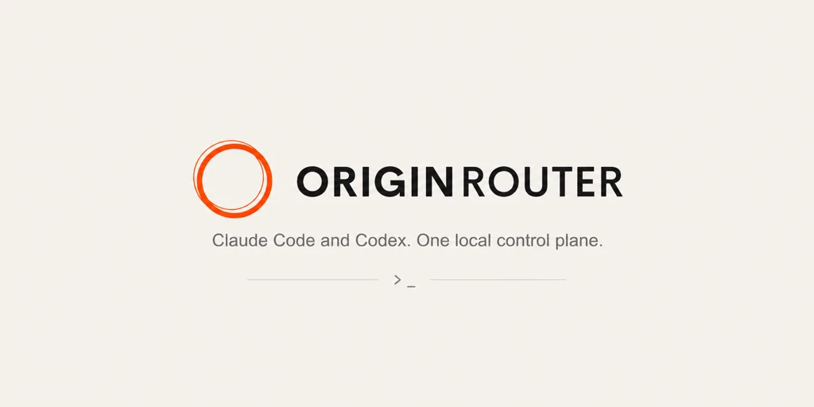

<p align="center">
  
</p>

<p align="center">
  <strong>English</strong> · <a href="README.zh-CN.md">简体中文</a>
</p>

<p align="center">
  Run Codex and Claude Code from one device-owned workspace.<br />
  Coordinate Agents, route models, control remote sessions, and keep approval decisions local.
</p>

<p align="center">
  <a href="https://www.npmjs.com/package/@originrouter/cli"></a>
  <a href="https://github.com/originrouter/originrouter_cli/actions/workflows/ci.yml"></a>
  
  <a href="LICENSE"></a>
</p>

<p align="center">
  <a href="#quick-start">Quick start</a>
  · <a href="#agent-workspace">Agent Workspace</a>
  · <a href="#command-map">Commands</a>
  · <a href="https://originrouter.com/docs/originrouter-tools/cli">Documentation</a>
  · <a href="https://github.com/originrouter/originrouter_cli/issues">Issues</a>
</p>

> [!IMPORTANT]
> OriginRouter CLI is pre-1.0. Compatibility-sensitive commands and stored
> schemas are changed carefully, but preview releases may include documented
> migrations.

## What OriginRouter does

OriginRouter is a local control plane for the coding Agents you already use. It
does not replace Codex or Claude Code. Their execution engines still do the
work; OriginRouter adds a shared workspace around them.

- Start with a goal instead of manually assembling Agent commands.
- Choose Codex or Claude Code as coordinator, or let Auto mode build the team.
- Coordinate planning, implementation, review, verification, and remote work.
- Preserve native Agent configuration, arguments, TUI, and resume workflows.
- Route local, cloud, and remote models through one configuration surface.
- Apply approval policy on the device that actually executes the Agent.
- Inspect sessions and control supported work from another authorized device.
- Keep display-safe activity and audit records without uploading raw workspaces.

```text
OriginRouter App (optional)
        │ authenticated Local API / encrypted account bridge
        ▼
OriginRouter CLI daemon ─── workspace · sessions · policy · local audit
        │
        ├── Codex app-server
        ├── Claude Agent SDK / Claude Code
        └── Compatibility Gateway ── LiteLLM ── model provider
```

## Install

Requirements:

- Node.js 22 or later
- Codex and/or Claude Code for the runtime you want to use
- Python 3.10 or later only when using the managed local LiteLLM proxy

Install the public npm package:

```bash
npm install --global @originrouter/cli
originrouter --version
```

Both executable names are available:

```bash
originrouter --help
or --help
```

## Quick start

Run these commands once on the machine that will execute your Agents:

```bash
# Check installed runtimes, account state, relay connectivity, and providers
originrouter doctor

# Install and start the user-level background service
originrouter service install
originrouter service start
```

Then open a project and start Agent Workspace:

```bash
cd your-project
originrouter
```

Or submit a goal directly. Codex is the default coordinator:

```bash
originrouter "Fix the login timeout and add regression tests"
originrouter -c claude --mode build-review \
  "Implement the change and have another Agent review it"
```

Agent Workspace uses the current directory automatically. You do not need to
pass the project path.

## Agent Workspace

Agent Workspace keeps the user in OriginRouter while the daemon runs managed
Codex or Claude sessions in the background. Plans, tasks, approvals, budgets,
messages, and results remain attached to one durable collaboration Run.

Choose a collaboration mode with `--mode` or switch inside the interactive
workspace with `/mode <name>` or Shift+Tab.

| Mode | Best for |
| --- | --- |
| `auto` | Let OriginRouter choose the smallest useful team for the goal |
| `solo` | Questions and small, self-contained tasks |
| `build-review` | Implementation followed by an independent review |
| `plan-build-verify` | Larger, production-sensitive, or cross-module work |
| `parallel-research` | Independent investigation across several areas |
| `review-panel` | Architecture choices and competing approaches |
| `remote-ops` | Work that requires a trusted participant on another device |

Useful options:

```bash
originrouter -c codex "<objective>"
originrouter -c claude "<objective>"
originrouter --mode plan-build-verify "<objective>"
originrouter --cloud-advice "Compare safe rollout strategies"
```

`--cloud-advice` is optional. It sends the objective and a typed, display-safe
capability summary to the OriginRouter AI Server. It excludes device IDs,
workspace paths, provider and model names, credentials, and environment values.
Manual mode selection remains authoritative.

Read the [Agent Workspace guide](docs/agent-workspace.md) for interactive
commands, confirmation policy, detached runs, and parallel-write safety.

## Native Agents and model routing

You can always launch an Agent directly and keep its existing configuration:

```bash
originrouter codex --originrouter-native-config
originrouter claude --originrouter-native-config
```

OriginRouter supports three model sources:

| Source | Use it when | Configure with |
| --- | --- | --- |
| Native Agent configuration | Keep the Agent's existing login and model | `--originrouter-native-config` |
| Local provider through LiteLLM | Use credentials stored on your own device | `provider`, `route`, `proxy` |
| OriginRouter Cloud or remote CLI | Use account models or another trusted device | `login`, `route cloud`, `route remote` |

Start with `originrouter agent setup`, or read the
[CLI documentation](https://originrouter.com/docs/originrouter-tools/cli) for
provider and route examples.

## Approval and remote control

Approval policy is evaluated on the device executing the Agent:

```bash
originrouter claude --originrouter-autonomy guarded
originrouter codex --originrouter-autonomy ai_review
originrouter claude --originrouter-autonomy custom \
  --originrouter-policy ~/.originrouter/policies/team-default.json
```

| Mode | Behavior |
| --- | --- |
| `manual` | Ask the user for supported approval decisions |
| `guarded` | Automatically allow a conservative built-in scope |
| `ai_review` | Ask the configured review model inside hard safety boundaries |
| `unrestricted` | Allow supported decisions without interactive review |
| `custom` | Evaluate a versioned policy document on the CLI device |

Unknown tools, ambiguous shell expansion, insufficient evidence, and unsafe
path resolution fail closed to user review.

Authorized devices can inspect sessions, send messages, stop work, and answer
supported interactions. Provider credentials remain local, while remote Agent
payloads use device end-to-end encryption.

## Shell completion

OriginRouter provides contextual completion for commands, options, modes, and
locally configured provider names.

```bash
# zsh — add to ~/.zshrc
source <(originrouter completion zsh)

# bash — add to ~/.bashrc
source <(originrouter completion bash)

# fish
originrouter completion fish > ~/.config/fish/completions/originrouter.fish

# PowerShell — add to $PROFILE
originrouter completion powershell | Out-String | Invoke-Expression
```

## Command map

| Area | Commands |
| --- | --- |
| Agent Workspace | `originrouter`, `-c`, `--mode`, `--cloud-advice` |
| Agents | `claude`, `codex`, `agent setup`, `agent detail`, `agent budget` |
| Collaboration | `collaborate`, `collaboration` |
| Models | `provider`, `route`, `proxy`, `compatibility` |
| Sessions | `sessions`, `devices`, `history` |
| Account and security | `login`, `logout`, `auth`, `security` |
| Local control | `service`, `local`, `token`, `daemon` |
| Utilities | `doctor`, `completion`, `run -- <command>` |

Run `originrouter --help` for the task-oriented overview and
`originrouter help all` for the exhaustive command surface.

## Security model

- Provider keys, OAuth tokens, device grants, and raw requests are excluded
  from display-safe cloud indexes.
- Full transcripts, tool output, source code, commands, and paths stay on the
  CLI device unless explicitly transported through an encrypted device channel.
- The Local API requires a per-installation bearer key, including on loopback.
- Approval policy is evaluated on the machine executing the Agent.
- Compatibility modules cannot access the filesystem, network, environment,
  processes, credentials, approval capabilities, or E2EE keys.

See [SECURITY.md](SECURITY.md) for vulnerability reporting.

## Documentation and contributing

- [CLI documentation](https://originrouter.com/docs/originrouter-tools/cli)
- [Command reference](https://originrouter.com/docs/originrouter-cli/commands)
- [Agent Workspace guide](docs/agent-workspace.md)
- [Contributing guide](CONTRIBUTING.md)
- [Release process](docs/releasing.md)

Development setup and test commands live in `CONTRIBUTING.md` rather than the
end-user installation flow.

## Third-party products and legal notice

OriginRouter is an independent open-source project. It is not affiliated with,
endorsed by, or sponsored by Anthropic or OpenAI.

OriginRouter interoperates with third-party developer tools and services,
including Claude Code and Codex. Users must obtain and maintain their own
accounts, subscriptions, licenses, and access rights, and must comply with the
applicable third-party terms and policies.

Third-party software and dependencies remain subject to their own licenses and
terms. Product names and marks belong to their respective owners; references
identify compatible products and do not imply endorsement or partnership.

AI-generated outputs and actions may be inaccurate, incomplete, or unsafe.
Users are responsible for reviewing them before relying on or executing them.

See [Third-party notices](THIRD_PARTY_NOTICES.md) for dependency and runtime
licensing details.

## License

[Apache License 2.0](LICENSE)
