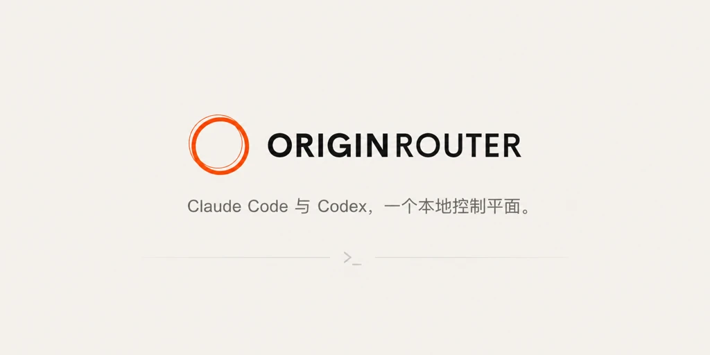

<p align="center">
  
</p>

<p align="center">
  <a href="README.md">English</a> · <strong>简体中文</strong>
</p>

<p align="center">
  通过一个由本机掌控的控制平面运行 Claude Code 与 Codex。<br />
  统一模型路由、远程会话、审批策略与本地审计。
</p>

<p align="center">
  <a href="https://www.npmjs.com/package/@originrouter/cli"></a>
  <a href="https://github.com/originrouter/originrouter_cli/actions/workflows/ci.yml"></a>
  
  <a href="LICENSE"></a>
</p>

<p align="center">
  <a href="https://originrouter.com/docs/originrouter-tools/cli">文档</a>
  · <a href="#快速开始">快速开始</a>
  · <a href="#命令地图">命令</a>
  · <a href="https://github.com/originrouter/originrouter_cli/issues">问题反馈</a>
</p>

> [!IMPORTANT]
> OriginRouter CLI 当前仍处于 1.0 之前的预览阶段。命令名称和持久化结构会谨慎维护兼容性，但预览版本仍可能包含有文档说明的迁移。

## 一个运行时，三种模型来源

OriginRouter 包装你已经在使用的 Agent，而不是替换它们的原生终端界面、项目配置、会话恢复语法或本地执行方式。

| 来源 | 适用场景 | 配置方式 |
| --- | --- | --- |
| Agent 原生配置 | 保留 Agent 已有的登录状态和模型 | `--originrouter-native-config` |
| LiteLLM 本地 Provider | 使用自己的 Provider 凭据进行路由 | `provider`、`route`、`proxy` |
| OriginRouter Cloud 或远程 CLI | 使用账户模型或另一台授权设备 | `login`、`route cloud`、`route remote` |

```text
OriginRouter App（可选）
        │ 认证的 Local API / 加密账户 Bridge
        ▼
OriginRouter CLI daemon ─── 会话 · 策略 · 本地审计
        │
        ├── Claude Code / Codex
        └── Compatibility Gateway ── LiteLLM ── 模型 Provider
```

运行 CLI 的设备始终是执行与权限策略的最终权威。Provider 凭据保留在本机，远程 Agent 数据使用设备端到端加密。

## 为什么使用 OriginRouter

- 保留 Claude Code 与 Codex 的原生参数、TUI 行为和会话恢复流程。
- 在本地 Provider、Cloud 模型和远程设备之间统一配置模型路由。
- 从其他设备查看会话、发送消息、停止任务并处理支持的交互请求。
- 在执行设备上评估手动、受保护、AI 审查、无限制或自定义审批策略。
- 使用签名且沙箱化的协议兼容补丁，不向更新服务暴露凭据。
- 在本机保存追加写入、哈希链接的审批和外部变更审计记录。
- 通过计划、实现、验证流程协调 Claude 与 Codex 参与者。

## 安装

安装公开 npm 包：

```bash
npm install --global @originrouter/cli
originrouter --version
```

从源码安装：

```bash
git clone https://github.com/originrouter/originrouter_cli.git
cd originrouter_cli
npm install
npm link
```

基本要求为 Node.js 22 或更新版本，以及你准备使用的 Claude Code 或 Codex。只有使用受管的本地 LiteLLM Proxy 时才需要 Python 3.10 或更新版本。

## 快速开始

```bash
# 检查依赖和连接状态
originrouter doctor

# 安装并启动用户级后台服务
originrouter service install
originrouter service start

# 在当前项目中打开统一 Agent Workspace
originrouter

# 或直接提交目标；默认由 Codex 担任协调者
originrouter "修复登录超时并补充回归测试"
originrouter -c claude --mode build-review "实现并独立审查这个修改"

# 使用 Agent 已有的登录、模型和环境配置启动
originrouter claude --originrouter-native-config
originrouter codex --originrouter-native-config
```

也可以配置由 OriginRouter 管理的模型路由：

```bash
originrouter proxy install

originrouter provider add team-anthropic \
  --type proxy \
  --litellm-provider anthropic \
  --api-key os.environ/ANTHROPIC_API_KEY \
  --model claude-sonnet-4-6

originrouter route set claude.main \
  --provider team-anthropic \
  --model claude-sonnet-4-6

originrouter proxy start --port 4000
originrouter claude
```

## Shell 命令补全

OriginRouter 提供命令、子命令、参数、枚举值以及本机 Provider 名称的上下文补全。

所有命令都可以使用完整命令名 `originrouter` 或短命令 `or`：

```bash
originrouter login
or login
```

```bash
# zsh：加入 ~/.zshrc
source <(originrouter completion zsh)

# bash：加入 ~/.bashrc
source <(originrouter completion bash)

# fish
originrouter completion fish > ~/.config/fish/completions/originrouter.fish

# PowerShell：加入 $PROFILE
originrouter completion powershell | Out-String | Invoke-Expression
```

## 审批模式

```bash
originrouter claude --originrouter-autonomy guarded
originrouter codex --originrouter-autonomy ai_review
originrouter claude --originrouter-autonomy custom \
  --originrouter-policy ~/.originrouter/policies/team-default.json
```

| 模式 | 行为 |
| --- | --- |
| `manual` | 由用户处理支持的审批决定 |
| `guarded` | 自动允许保守的内置安全范围 |
| `ai_review` | 在硬安全边界内交给已配置的审查模型判断 |
| `unrestricted` | 对支持的决定不进行交互式审查 |
| `custom` | 在 CLI 设备上评估版本化的审批策略文档 |

未知工具、含糊的 shell 展开、证据不足和无法安全解析的路径都会回退到用户审查。

## 命令地图

| 领域 | 命令 |
| --- | --- |
| 健康与诊断 | `status`、`doctor`、`sessions`、`devices`、`env print` |
| Agent | `claude`、`codex`、`agent setup`、`agent detail`、`agent budget`、`agent history` |
| 模型 | `provider`、`route`、`proxy`、`compatibility` |
| 账户 | `login`、`logout`、`auth`、`security` |
| 本地控制 | `service`、`local`、`token`、`daemon` |
| Agent Workspace | `originrouter`、`-c`、`--mode` |
| 协作 | `collaborate`、`collaboration` |
| 工具 | `history`、`completion`、`run -- <command>` |

运行 `originrouter --help` 查看面向任务的概览，运行 `originrouter help all` 查看完整命令面，或阅读[CLI 命令参考](https://originrouter.com/docs/originrouter-cli/commands)。

## 安全模型

- Provider key、OAuth token、设备授权和原始请求不会进入 display-safe Cloud 索引。
- 完整对话、工具输出、源代码、命令和路径保留在 CLI 设备，除非通过加密设备通道明确传输。
- Local API 即使只监听 loopback，也要求每次安装随机生成的 bearer key。
- 审批策略在真正执行 Agent 的设备上评估。
- Compatibility 模块不能访问文件系统、网络、环境变量、进程、凭据、审批能力或 E2EE key。

## 开发

```bash
npm install
npm test
npm run release:check
npm pack --dry-run
```

主要子系统也提供独立测试：

```bash
npm run test:agent-control
npm run test:collaboration
npm run test:compatibility
```

## 文档

- [CLI 使用指南](https://originrouter.com/docs/originrouter-tools/cli)
- [命令参考](https://originrouter.com/docs/originrouter-cli/commands)

## 第三方产品与法律声明

OriginRouter 是独立的开源项目，与 Anthropic 或 OpenAI 不存在隶属、赞助、
认可或合作关系。

OriginRouter 可与包括 Claude Code 和 Codex 在内的第三方开发工具及服务进行
互操作。用户需要自行取得并维护相应的账户、订阅、许可证和访问权限，并遵守
适用的第三方条款与政策。

第三方软件及依赖项继续受其各自许可证和使用条款约束。产品名称和标识归其
各自权利人所有；相关名称仅用于说明兼容性，不代表任何认可或合作关系。

AI 生成的内容和操作可能不准确、不完整或不安全。用户有责任在依赖或执行前
进行审核。

依赖项和运行时组件的许可详情参见[第三方声明](THIRD_PARTY_NOTICES.md)。

## 许可证

[Apache License 2.0](LICENSE)
