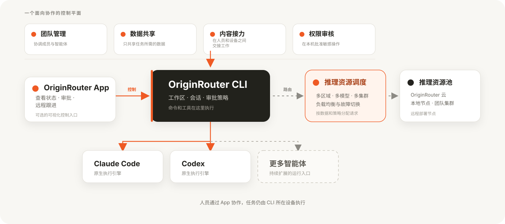

<p align="center">
  
</p>

<p align="center">
  <a href="README.md">English</a> · <strong>简体中文</strong>
</p>

<p align="center">
  用一个本地控制层运行 Claude Code 与 Codex。<br />
  统一任务协作、模型路由、审批和跨设备跟进。
</p>

<p align="center">
  <a href="https://www.npmjs.com/package/@originrouter/cli"></a>
  <a href="https://github.com/originrouter/originrouter_cli/actions/workflows/ci.yml"></a>
  
  <a href="LICENSE"></a>
</p>

<p align="center">
  <a href="#快速开始">快速开始</a>
  · <a href="#选择使用入口">选择入口</a>
  · <a href="https://originrouter.com/docs/originrouter-cli/overview">CLI 文档</a>
  · <a href="https://originrouter.com/docs/originrouter-app/overview">App 文档</a>
  · <a href="https://github.com/originrouter/originrouter_cli/issues">问题反馈</a>
</p>

> [!IMPORTANT]
> OriginRouter CLI 当前处于 1.0 之前的预览阶段。升级前请阅读发布说明；预览
> 版本可能包含已说明的迁移要求。

## OriginRouter CLI 是什么？

OriginRouter CLI 是围绕现有 Coding Agent 的本地执行与控制层。Claude Code 和
Codex 仍负责实际执行，OriginRouter 为它们提供统一的工作区、模型路由、协作、
审批、会话控制和远程跟进能力。

- 直接提交目标，不需要手动拼接多个智能体命令。
- 直接使用 Claude Code 或 Codex，也可以让智能体工作区协调团队。
- 在 OriginRouter Cloud、本地模型服务和可信远程推理集群之间路由，并按数据区域和负载策略分配请求。
- 命令、工具、工作区访问和审批决定都留在真正执行任务的设备上。
- 连接可选的 OriginRouter App，查看状态、处理审批并远程跟进任务。

<p align="center">
  
</p>

## 选择使用入口

| 入口 | 适合场景 |
| --- | --- |
| `originrouter` | 需要持续工作区、任务规划、分工或审查。 |
| `originrouter claude` | 想保留 Claude Code 原生终端体验，同时使用 OriginRouter 的控制能力。 |
| `originrouter codex` | 想保留 Codex 原生终端体验，同时使用 OriginRouter 的控制能力。 |
| OriginRouter App | 想从另一台设备查看状态、处理审批或远程跟进。 |

App 不是必需组件。命令、工具和工作区访问始终在 CLI 所在设备执行。

## 安装

### 推荐：官方安装程序

macOS、Linux 和 WSL：

```bash
curl -fsSL https://originrouter.com/install.sh | bash
```

Windows PowerShell：

```powershell
irm https://originrouter.com/install.ps1 | iex
```

安装程序会安装 CLI 并启动引导式初始化。初始化会检查并在确认后补齐缺少的
Claude Code、Codex、OriginRouter 后台服务、受管 Python 和 Local Proxy 运行时。

### 通过 npm 安装

如果你需要自行管理 CLI 版本，可以使用 npm：

```bash
npm install --global @originrouter/cli
originrouter setup
```

运行要求：

- Node.js 22 或更新版本。
- 能访问 npm 以及 Claude Code、Codex 官方安装服务的网络环境。
- 是否需要 Cloud 账户或模型服务凭据，取决于你之后选择的路由。

完整初始化默认包含 Local Proxy，因为它支持本地、第三方、企业网关和自部署模型。
如果你只使用 OriginRouter Cloud 或已经授权的远程设备，不需要接入第三方 API、自部署
模型或本地模型服务，可以明确跳过：

```bash
originrouter setup --no-proxy
```

自动化环境使用 `originrouter setup --yes`，只查看计划使用
`originrouter setup --dry-run`。平台差异和完整安装说明见
[CLI 概览与安装](https://originrouter.com/docs/originrouter-cli/overview)。

## 快速开始

安装完成后，进入项目并打开智能体工作区：

```bash
cd 你的项目
originrouter
```

也可以直接提交目标：

```bash
originrouter "修复登录超时并补充回归测试"
```

如果你想保留智能体原生终端：

```bash
originrouter claude
originrouter codex
```

首次使用 OriginRouter Cloud 路由时，登录并初始化一次：

```bash
originrouter login
originrouter agent setup --cloud
originrouter doctor
```

如果你希望继续使用 Claude Code 或 Codex 官方订阅、登录状态、环境变量和项目配置，
可以使用原生配置模式：

```bash
originrouter claude --native-config
originrouter codex --native-config
```

完整首次运行流程见 [CLI 快速开始](https://originrouter.com/docs/originrouter-cli/quickstart)。

## 接下来可以做什么

### 协调更复杂的任务

智能体工作区会围绕项目保留长期对话，适合规划、实现、独立审查、验证和支持的
跨设备任务。可以通过 `--mode` 选择模式，也可以在工作区内切换。

```bash
originrouter --mode plan-build-verify "准备并验证这次迁移"
```

参阅[智能体工作区](https://originrouter.com/docs/originrouter-cli/agent-workspace)
和[多智能体协作](https://originrouter.com/docs/originrouter-cli/collaboration)。

### 接入模型服务

最简单的方式是使用 Cloud 路由。如果凭据和网络必须留在本机，也可以接入本地模型
服务、企业网关或自部署模型。使用 `provider` 和 `route` 命令配置，Local Proxy
文档会说明可用的接入方式。

参阅[模型与路由](https://originrouter.com/docs/originrouter-cli/routing)
和[模型服务参考](https://originrouter.com/docs/originrouter-cli/providers-reference)。

### 从 App 或另一台设备跟进任务

安装 OriginRouter App 并登录，然后连接一台在线且可信的 CLI 设备。App 可以查看
会话、发送受支持的输入和处理审批。模型共享与工作区访问是相互独立的权限，只有
确实需要时才启用。

参阅[远程访问](https://originrouter.com/docs/originrouter-cli/remote)、
[App 概览](https://originrouter.com/docs/originrouter-app/overview)和
[设备与安全](https://originrouter.com/docs/originrouter-app/devices-security)。

## 常用命令

| 目的 | 命令 |
| --- | --- |
| 打开当前项目 | `originrouter` |
| 运行 Claude Code | `originrouter claude` |
| 运行 Codex | `originrouter codex` |
| 检查安装和连接状态 | `originrouter doctor` |
| 初始化或修复本机环境 | `originrouter setup` |
| 登录或退出账户 | `originrouter login` / `originrouter logout` |
| 管理模型服务 | `originrouter provider` |
| 查看路由 | `originrouter route list` |
| 查看设备和会话 | `originrouter devices` / `originrouter sessions` |
| 查看全部命令和参数 | `originrouter help all` |

运行 `originrouter --help` 可以查看按任务组织的命令概览。

## 安全与数据边界

- 工作区文件、Shell 命令、工具调用和智能体执行都留在 CLI 所在设备。
- 即使只监听 `127.0.0.1`，本地接口仍需要设备密钥。
- 远程控制不会自动暴露模型服务凭据，也不会自动授予工作区访问权限。
- 发送给 Cloud 或其他模型服务的请求，仍按对应服务的条款和数据策略处理。

完整说明见[数据与执行边界](https://originrouter.com/docs/originrouter-concepts/data-boundaries)
和 [SECURITY.md](SECURITY.md)。

## 文档

- [CLI 概览与安装](https://originrouter.com/docs/originrouter-cli/overview)
- [CLI 快速开始](https://originrouter.com/docs/originrouter-cli/quickstart)
- [智能体工作区](https://originrouter.com/docs/originrouter-cli/agent-workspace)
- [模型与路由](https://originrouter.com/docs/originrouter-cli/routing)
- [命令参考](https://originrouter.com/docs/originrouter-cli/commands)
- [CLI 故障排查](https://originrouter.com/docs/originrouter-cli/troubleshooting)
- [OriginRouter App 文档](https://originrouter.com/docs/originrouter-app/overview)

开发环境与贡献规则见 [CONTRIBUTING.md](CONTRIBUTING.md)。

## 第三方产品与许可证

OriginRouter 是独立的开源项目，与 Anthropic 或 OpenAI 没有隶属、背书或赞助关系。
Claude Code 和 Codex 仍然受各自账户、许可证、服务条款和使用政策约束。

智能体生成的内容和执行结果可能不准确或不安全，请在依赖或执行前进行检查。

OriginRouter 使用 [Apache License 2.0](LICENSE)。依赖和运行时许可说明见
[THIRD_PARTY_NOTICES.md](THIRD_PARTY_NOTICES.md)。
